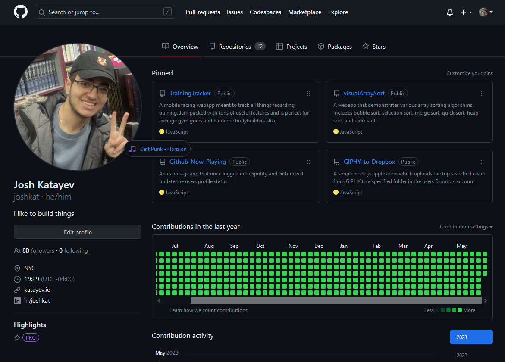

# Github-Now-Playing

An Express.js app that let's you share what you're currently listening to on Spotify to your Github Status

---

<center>



</center>

## Self Hosting

Before running the application, make sure you have Node.js installed on your system. You can download it from the official [Node.js website](https://nodejs.org)

1. Clone this repository or download the source code.
2. Open a terminal window and navigate to the project directory.
3. Create the file **.env** in the root of the directory where you'll store all the API keys, format it as follows

```javascript
//.env
SPOTIFY_SECRET=YOUR_SPOTIFY_SECRET
SPOTIFY_ID=YOUR_SPOTIFY_ID
GITHUB_ID=YOUR_GITHUB_ID
GITHUB_SECRET=YOUR_GITHUB_SECRET
```

4. Assuming you have node installed on your machine within the same directory type the following two commmands
```bash
npm install
node server.js
```
Once the server is running, you can access it by navigating to [http://localhost:3000](http://localhost:3000) in your web browser.

## Obtain API Keys


[Github Token](https://github.com/settings/tokens) (redirect URI: http://localhost:3000/github_code)

[Spotify App](https://developer.spotify.com/dashboard) (redirect URI: http://localhost:3000/spotify_code)
